<div align="center">

# BoomEarth

### 多模态输入 · 多风格处理中台 · 多样式视频生成

**把一份素材，推进成一条能播放、能质检、能恢复、能持续复制的短视频生产线。**

[](pyproject.toml)
[](#隐私不是补丁而是系统边界)
[](#skill-组成)
[](#后端多样式生成)
[](LICENSE)

</div>

---

## 一条视频，能不能做到约 4 毛、约 20 分钟？

可以，但必须把条件说清楚。

在本地模型与运行环境已经部署完成、使用本地 TTS、关闭 HeyGen、复用已审核基础素材，且外部服务价格与既有配置不变时，BoomEarth 的基础口播快线新增云端用量可以低至约 **0.4 元**，约 **20 分钟**完成一条视频。

它从第一天就按生产系统来设计，不靠一个 Prompt 撑完整流程。

BoomEarth 把选题、来源采集、内容改写、配音、字幕、插画、运动、数字人、封面、QC 和归档，做成了一套可以反复运行的内容生产系统。每一步都有输入、输出、状态、哈希和失败边界；中途出错，不需要推倒重来。

> 公开的是生产系统，私密的是你的来源、逐字稿、凭据和 Provider 响应。

## 三层内容生产架构

```mermaid
flowchart LR
    subgraph A[前端：多模态输入]
        A1[本地视频 / 音频]
        A2[B站 / YouTube / TikTok]
        A3[X 图文 / 长文]
        A4[GitHub 项目 / Skill]
        A5[现成文稿 / 待制作交接稿]
    end

    subgraph B[中端：多风格处理中台]
        B1[来源隔离与转写]
        B2[洗稿 / 人话 / 钩子 / 共鸣]
        B3[内容计划与场景导演]
        B4[小黑插画 / 漫画解释风]
        B5[IndexTTS2 / 词级字幕]
        B6[数字人 / 运动 / 封面]
        B7[SHA-256 / QC / 断点续跑]
    end

    subgraph C[后端：多样式生成]
        C1[16:9 横版口播]
        C2[无数字人纯内容版]
        C3[左下角圆形数字人版]
        C4[多风格插画成片]
        C5[3:4 作品封面]
        C6[成片 / 字幕 / 工程 / 质检归档]
    end

    A --> B --> C
```



### 前端：多模态输入

BoomEarth 不要求创作者把所有内容先整理成一种格式。入口可以是：

- 本地视频或音频；
- 获授权的 B 站、YouTube、TikTok 等可播放视频 URL；
- X 文章、长文和正文图文；
- GitHub 仓库、Skill 目录或 `SKILL.md`；
- 已经写好的逐字稿、口播稿或待制作交接稿。

不同来源走不同专业管线，但最终汇入同一套无来源交接合同。原始 URL、标题、逐字稿和 Provider 响应只留在 Git 忽略的私有工作单，公开文稿与最终归档不携带来源隐私。

### 中端：多风格处理中台

中端由 Skill、确定性脚本和不可变合同共同组成。

- 文案层：选题、角度、洗稿、人话、3 秒钩子、共鸣、AI 痕迹检查、标题审阅；
- 视觉层：逐场景语义规划、小黑插画、漫画解释风、组件级运动和场景差异化；
- 声音层：本地 IndexTTS2 黑金 v3、最终旁白锁定、词级 ASR 字幕；
- 人物层：无数字人路线，或使用同一锁定旁白生成圆形数字人；
- 包装层：Punk 巨型中文标题封面、gbro 真人高点击封面；
- 工程层：计划哈希、输入哈希、调用预算、零重试、零 fallback、QC 与恢复证据。

你可以更换其中一个风格或组件，不需要重做整条生产线。

### 后端：多样式生成

同一份内容可以生成不同交付形态：

| 输出 | 默认能力 |
| --- | --- |
| 横版成片 | `1920×1080 / 30fps / H.264 / AAC` |
| 无数字人版 | 纯插画、字幕与旁白，画面更干净 |
| 数字人版 | 左下角圆形人物，可切换标准或放大档位 |
| 插画风格 | 小黑白底插画、V4 漫画解释风及精确注册主题 |
| 字幕 | 基于最终锁定音频的真实词级时间戳，严格单行 |
| 作品封面 | 3:4 Punk 大字报、gbro 真人营销封面 |
| 交付包 | 成片、旁白、字幕、插画、联系表、QC、工程回执 |

## 为什么它更像一套大厂内容基础设施

### 1. 最终音频才是时间轴

很多自动视频项目先按字数猜时长，再把字幕硬塞进场景。BoomEarth 在旁白最终锁定后，用同一份精确音频生成词级时间戳。字幕、场景和数字人都围绕这条时间轴对齐。

### 2. 每个场景都必须有语义画面

字幕、文字卡、机器人占位图和数字人，都不能冒充场景插画。每一场都要有与旁白语义对应的真实素材，并进入 manifest、联系表和语义 QC。

### 3. 失败不会变成重复付费

真实外部调用绑定 work id、输入 SHA-256、不可变计划、Provider、模型、预算、超时和零重试策略。失败证据会被保留，下次从第一个未完成 gate 继续，而不是重新烧一遍额度。

### 4. 成片不是唯一交付物

BoomEarth 同时交付旁白、字幕六件套、插画素材、数字人 master、联系表、关键帧、QC 和 delivery receipt。最终 MP4 能播放，只是交付门槛之一。

### 5. 公开边界可以重新验证

生产计划、音频、字幕、插画、视频和质检证据通过 SHA-256 绑定。归档后的项目仍然可以只读复验，避免“当时能跑，后来谁也说不清”。

## Skill 组成

当前仓库包含 **41 个项目级 Skill 入口**，其中 **18 个 `katerj-*` Skill 是生产真源**；历史 `ra-*`、`rn-*` 等名称保留为兼容桥，旧流程不需要一次性重写。

| 层级 | 代表 Skill | 职责 |
| --- | --- | --- |
| 总编排 | `ra-source-to-video`、`katerj-video-director` | 从来源类型路由到完整成片交付 |
| 来源层 | `katerj-source-acquisition`、`katerj-source-transcription`、`ra-x-article-import`、`ra-github-skill-import` | 授权采集、媒体校验、来源转写和私有快照 |
| 文案层 | `katerj-script-rewrite`、`katerj-human-writing`、`katerj-video-hook`、`katerj-hook-review`、`katerj-resonance-review` | 深入浅出改写、开场钩子、去 AI 味和共鸣检查 |
| 视觉层 | `katerj-xiaohei-illustrations`、`ra-video-illustrations`、`katerj-motion-director` | 场景素材、风格约束、组件级动作和语义 cue |
| 声音字幕 | `katerj-local-tts`、`katerj-audio-subtitles`、`katerj-caption-rendering` | 本地配音、最终音频词级字幕和单行渲染 |
| 质量交付 | `katerj-replica-qc`、`katerj-ai-writing-review`、`ra-video-cover` | 视觉复验、文案诊断、封面与最终交付检查 |

Skill 负责理解任务和阶段路由，`automation/scripts` 负责确定性执行，`src/boomearth` 负责合同、安全和核心能力。三者分开，才能让流程既有创造力，又不会失控。

## 最有特点的功能

- **Source-free 编译器**：公开交接稿不携带来源 URL、源标题和逐字稿。
- **多入口自动路由**：视频、X 图文、GitHub Skill 和现成文稿各走正确专业管线。
- **黑金 v3 本地旁白**：只接受 canonical lossless WAV，不静默切换语音 Provider。
- **真实词级字幕**：最终音频完成后再做 ASR，字幕不按字数插值。
- **小黑插画生产线**：逐场景生成有动作、有语义、有文字表达能力的内容画面。
- **Circle Avatar**：同一数字人 master 本地复用，圆形安全区合成，不让人物遮字幕。
- **双封面系统**：Punk 巨型透视中文标题与 gbro 真人爆款封面均支持 3:4 交付。
- **不可变外部调用计划**：一次批准只对应一个输入、一个计划、一个 Provider 和一个预算。
- **断点续跑**：失败版本、旧音频、旧字幕、旧视频和 QC 证据全部保留。
- **机器可验证归档**：没有通过 `check_delivery.py`，就不能称为推荐最终成片。

## 从一份素材到最终成片

```text
授权输入
  ↓
私有采集 + SHA-256 锁定
  ↓
来源转写 / 正文读取
  ↓
深入浅出洗稿 + 钩子 + 人话 + 共鸣审阅
  ↓
内容计划 + 场景导演 + 多风格插画
  ↓
IndexTTS2 最终旁白锁定
  ↓
最终音频词级 ASR + 单行字幕
  ↓
可选圆形数字人 + 组件级运动
  ↓
1080P 横版视频 + 3:4 作品封面
  ↓
逐场景 QC + 联系表 + delivery checker
  ↓
统一归档
```

## 项目结构

```text
BoomEarth/
├─ .agents/skills/              # 41 个项目级 Skill 与兼容桥
├─ automation/
│  ├─ config/                   # 本地路由与非敏感配置
│  └─ scripts/                  # 采集、编译、渲染、QC、归档脚本
├─ src/boomearth/               # 合同、安全边界与核心生产能力
├─ tests/                       # 合同、隐私、媒体和恢复测试
├─ 01-内容生产/视频工作台/
│  ├─ .internal/                # Git 忽略的来源与 Provider 私有证据
│  ├─ 待制作/                   # 已形成公开生产交接的任务
│  ├─ 制作中/                   # 正在生成或等待恢复的工程
│  └─ 已制作/                   # 成片、工程与 QC 的统一归档
├─ docs/                        # 架构历史、上线状态与生产说明
├─ LICENSE
└─ README.md
```

## 快速开始

### 环境准备

```powershell
git clone https://github.com/kaiteJiang/BoomEarth.git
cd BoomEarth
uv sync --dev
```

### 本地安全检查

```powershell
uv run pytest tests/test_config.py -q
uv run python automation/scripts/check_env.py
```

这些命令不会调用在线 Provider，也不会打印凭据。真实采集、来源转写、ImageGen、最终音频 ASR 和 HeyGen 均有独立授权边界。

完整生产说明：

- [开发历史与架构演进](docs/PROJECT-HISTORY.md)
- [开源介绍口播稿](docs/OPEN-SOURCE-STORY.md)
- [KaterJ Skill 迁移说明](.agents/skills/KATERJ-MIGRATION.md)
- [上线就绪状态](docs/LAUNCH-READINESS.md)
- [第三方来源与许可证边界](LICENSE-NOTES.md)

## “月入 10W”不是一句口号

月入 10W 建立在四项稳定能力上：

1. 同一套生产线持续接收不同来源；
2. 内容质量不会因为批量生产明显下降；
3. 每条视频的时间、费用和失败成本可以计算；
4. 一套素材能快速生成不同风格、不同人物和不同包装版本。

BoomEarth 要解决的正是这四件事。

它不会承诺任何人安装项目后自动获得 10W 收入。它提供的是一套可以继续打磨的内容基础设施：当选题、账号定位和分发能力已经成立，生产端不再成为增长瓶颈。你可以把时间从反复剪辑、手动对轴和来回找文件，转回选题、表达和商业化。

这让短视频自动化从省一次时间，变成可以长期使用的生产能力。

## 隐私不是补丁，而是系统边界

- 来源 URL、源标题、源逐字稿和 Provider 响应只进入 `.internal`；
- API Key、Token、Cookie 和私有配置只允许存在于被忽略的 `.env` 或进程环境；
- 默认测试不调用 live API；
- 公开交接稿、Git 历史和最终报告不得出现私有来源；
- 外部调用失败后不自动重试、不切换 Provider、不重复收费；
- 只有通过媒体规格、字幕、语义画面、数字人安全区和 delivery checker 的视频，才是推荐最终成片。

## 许可证

BoomEarth 原创代码与 `katerj-*` Skill 按根目录 [LICENSE](LICENSE) 的 MIT 条款提供。

兼容目录中的第三方脚本、字体、示例和素材不会因为进入本仓库而被重新许可；它们继续遵循原许可证及 [LICENSE-NOTES.md](LICENSE-NOTES.md)。使用任何来源内容前，请确认你拥有相应权利。

## 特别感谢

BoomEarth 能从一个视频脚本，走到今天这套可复验、可恢复、可持续扩展的生产系统，离不开开源社区和中文 AI 创作者的启发。

特别感谢 **卡神、雪踏大佬、苍何老师、ChenShuo 老师**，以及持续分享文章、方法、Skill、代码和实战经验的各位 AI 大佬。

AI 时代最让人兴奋的，不只是模型越来越强，而是我们真的可以站在巨人的肩膀上，把一次灵感继续做成一套人人都能使用的系统。

