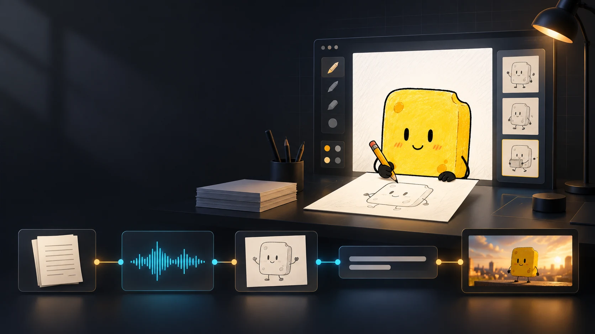
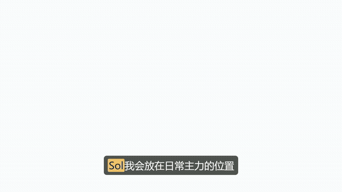
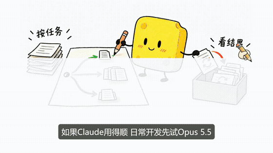
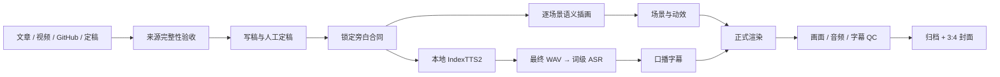

<div align="center">

# BoomEarth

### 让内容走完从「想讲清楚」到「能播放、能检查、能接着做」的全流程

**Agent 编排 · 本地配音 · 语义插画 · 真实词级字幕 · 1080p 成片**

[快速部署](docs/DEPLOYMENT-AND-USAGE.md) · [制作手册](docs/VIDEO-PRODUCTION-RUNBOOK.md) · [连续编排](docs/VIDEO-CONTINUOUS-ORCHESTRATION.md) · [观看样片](docs/assets/sponge/2026-09/fullscene-sample.mp4)



</div>

> **内容属于创作者，制作过程可以成为系统。** BoomEarth 把采集、写稿、插画、配音、字幕、动效、质检和归档组织成一条可恢复的工作流。它不是替你决定观点的模板，也不是装好依赖就能无配置运行的云端服务。

## 先看效果

| 手绘场景与原生字 | 字幕跟随真实语音 |
| --- | --- |
|  |  |
| [观看高清片段](docs/assets/showcase/2026-09/clip-draw.mp4) | [观看高清片段](docs/assets/showcase/2026-09/clip-caption.mp4) |

上面是从正式成片截取的短片段。更早的 [32 秒海绵全幅样片](docs/assets/sponge/2026-09/fullscene-sample.mp4) 与 [媒体检查回执](docs/assets/sponge/2026-09/sample-qc.json) 保留作风格和清晰度参考；完整新作的旁白、画面和字幕以各自工程回执为准。

| 判断先于装饰 | 事实与细节可见 | 同任务比较结果 |
| --- | --- | --- |
|  |  |  |

海绵必须在场景里真正做事：移开榜单、核对证据、记录返工。手写字长在插画里，字幕另由音频时间轴驱动。画面为完整原生生成的 1672×941 PNG，公开展示图只做 WebP 编码；最终视频输出 1920×1080。

## 它解决什么

很多创作者的难点不是没有文稿，而是每次出片都要重新拼一遍工具：文章在哪、图该落在哪段、配音做到哪、字幕有没有跟上真实语速、最后文件能否复查。BoomEarth 把这些交接变成有边界的产物和校验。

| 环节 | 系统处理的事 | 创作者保留的决定 |
| --- | --- | --- |
| 内容入口 | 识别 X、视频、GitHub、现成文稿；采集失败时按故障类型修复并重新验收完整来源 | 来源是否可信、核心观点是什么 |
| 文稿 | 按事实和表达目标写稿；定稿后用 SHA-256 锁住全文 | 口吻、立场、最终定稿 |
| 画面 | 按段落语义规划动作与物件，生成完整场景，逐图检查角色、文字、留白和禁用意象 | 哪个画面真正把话说明白 |
| 声音与字幕 | 本地 IndexTTS2 配音；最终 WAV 只做一次词级 ASR，再按口播语义断句 | 声音参考与字幕重点 |
| 动效与交付 | 文字和卡片随有效内容定尺寸；手持铅笔的绘制指针、稀疏重点底色、逐场景 QC、全片解码、归档 | 成片是否达到自己的发布标准 |

### 一条能继续往下走的生产线



插画与本地配音在旁白合同确定后并行。配音可能持续较久，按 30 分钟节拍检查已完成片段和异常，期间继续做画面；只有最终 WAV、manifest 和音色来源校验通过，才进入 ASR 与正式时间轴。中断后从项目 note、真实文件和哈希恢复，不因换会话重复合成已验收素材。

### 画面有对应，动效有节制

默认是 `sponge-host-handdrawn-v1`：白底、暖黄方块海绵、铅笔线和少量彩铅。每张图要有角色参与当下语义动作，保留图片原生手写标签。屏幕的视觉重心靠近横向三分之二线，画面约占 85%；底部留给单行字幕。绘制过程使用小手持铅笔的指针，尽量让显现区域跟着这句旁白走。

字幕边框跟随实际文字宽度，卡片并列时保持统一尺度，只突出当前说到的那张。底色仅标注少量核心词；句中逗号以空格呈现，行尾只保留问号。字幕的词时间来自最终音频，不按字数估时。详见 [字幕与断句规则](.agents/skills/katerj-audio-subtitles/SKILL.md) 和 [动效导演](.agents/skills/katerj-motion-director/SKILL.md)。

## 开始部署

当前主要在 Windows 环境验证。先准备 Git、Python 3.11、[uv](https://docs.astral.sh/uv/)、Node.js 22+、FFmpeg 与 ffprobe；随后安装仓库依赖：

```powershell
git clone https://github.com/kaiteJiang/BoomEarth.git
cd BoomEarth
uv python install 3.11
uv sync --dev
npm ci
uv run pytest tests/test_config.py -q
npm run hf:doctor
```

这一步只验证基础代码和渲染环境。要制作有声视频，还需按 [部署与使用教程](docs/DEPLOYMENT-AND-USAGE.md)接入自己的 IndexTTS2 环境、授权参考录音、可用的图像生成能力及最终音频 ASR。仓库不会附赠模型权重、作者音色、服务密钥或 API 额度。第一次建议先做 20–30 秒小片，确认声音、图片、字幕和渲染四条链路都通，再做长片。

## 阅读地图

| 想做的事 | 从这里开始 |
| --- | --- |
| 新对话做视频，或恢复中断项目 | [制作 runbook](docs/VIDEO-PRODUCTION-RUNBOOK.md) 与 [总控 Skill](.agents/skills/ra-source-to-video/SKILL.md) |
| 理解失败后的采集修复和 30 分钟配音节拍 | [连续制作编排](docs/VIDEO-CONTINUOUS-ORCHESTRATION.md) 与 [来源修复经验](docs/SOURCE-RECOVERY-LEDGER.md) |
| 看海绵角色与插画约束 | [角色外观合同](video-daheihuang/sponge-ip/DESIGN.md) 与 [插画 Skill](.agents/skills/ra-video-illustrations/SKILL.md) |
| 查完整安装、音色和外部能力配置 | [部署与使用教程](docs/DEPLOYMENT-AND-USAGE.md) |
| 查项目历史与兼容入口 | [项目历史](docs/PROJECT-HISTORY.md) 与 [Skill 迁移](.agents/skills/KATERJ-MIGRATION.md) |

核心合同和验证器在 `src/boomearth/`，执行脚本在 `automation/scripts/`，离线回归在 `tests/`。本地 `01-内容生产/视频工作台/` 存放私有来源与生产工程，不作为公开仓库的示例目录整体推送。

## 设计边界

定稿前可以改写，定稿后不能私自改词。来源只读，完整性不够就继续诊断，不拿标题或残片冒充原文。图片要有真实生成回执和逐场景语义检查；技术通过也不代替创作者观看成片。默认不使用数字人，也不自动向平台发布。

公开仓库只放代码、文档和经过选定的演示画面。`.env`、Cookie、私人来源、Provider 原始响应、音色参考录音和生产中的整套工程都留在本地。原创代码和项目自有 Skill 见 [MIT LICENSE](LICENSE)；第三方模型、字体与素材仍遵循各自许可，详情见 [LICENSE-NOTES.md](LICENSE-NOTES.md)。

<div align="center">

**写清楚一件事，再让声音、画面和时间轴一起把它讲出来。**

</div>
