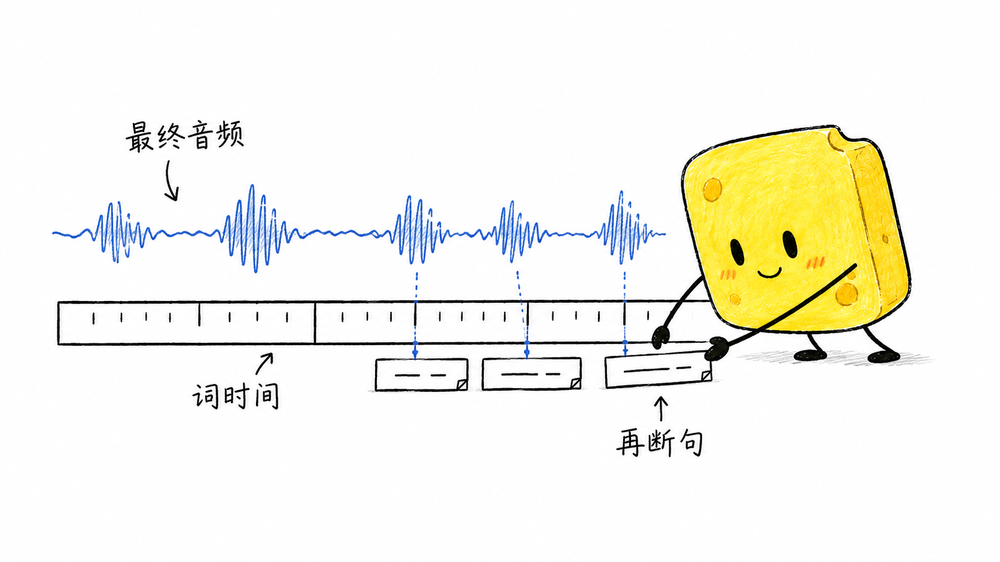

# BoomEarth

### 把一份内容，做成有声音、有画面、可持续复用的视频


BoomEarth 是一套 **Agent 驱动、本地优先的开源视频工作流**。把文章、文稿、视频或 GitHub 项目交给它，由 Agent 理解内容、组织表达，再串起插画、配音、真实时间字幕、动效、质检与归档。

它省下的，不只是剪一条视频的时间，而是每次重新找工具、对字幕、改尺寸、翻素材和整理工程的重复劳动。代码和流程公开，内容和生产资产留在自己手里。

[部署与使用完整教程](docs/DEPLOYMENT-AND-USAGE.md) · [观看最新样片](docs/assets/sponge/2026-09/fullscene-sample.mp4) · [图片与样片说明](docs/sponge-fullscene-sample.md) · [开发历史](docs/PROJECT-HISTORY.md)

## 先看这一版

[](docs/assets/sponge/2026-09/fullscene-sample.mp4)

最新默认：**方块海绵插画 + 口播 + 单行字幕**，默认不加数字人。点击图片打开 MP4；如果客户端不内嵌播放，可以下载观看。

只把原小黑角色替换为已定稿海绵，其他规则沿用原版：白底融合、原生手写中文、完整语义场景和组件级动作。人物要真正参与表达，不是站在一旁陪衬。

| 定稿再配音 | 根据真实音频断句 |
| --- | --- |
|  |  |
| 减少装饰，留下重点 | 画面和旁白对齐 |
|  |  |

这是一条风格与清晰度审阅样片：32.298 秒，1920×1080、30fps、H.264/AAC，完整解码与字幕检查通过。四张原图实际为 1672×941，以 1440×810 显示，没有把小图放大冒充高清。动作是原生画面的分组件显现，不宣称已经实现任意文稿的全身角色动画。[公开媒体检查回执](docs/assets/sponge/2026-09/sample-qc.json)

## 为什么值得用

- **把重复工作交给流程。** 每次换的是内容，不必重新搭配音、字幕、渲染和归档工具。
- **文稿有理解，画面有重点。** 当前文稿统一由 Astra 直接编写；正文根据输入自由组织，不调用“人话”“去 AI 味”类 Skill。开头和结尾的协作规则另行讨论，不擅自套新模板。
- **声音决定时间。** 先锁定最终旁白，再用真实词级时间戳做字幕和场景对齐，不按字数猜时长。
- **能检查，也能接着做。** 计划、音频和素材带哈希；失败保留证据，从未完成阶段恢复。已通过的资产不随意重做。
- **低成本来自分工。** 配音与合成尽量本地运行，按需使用生图和 ASR。不开数字人，就不产生对应生成开销。

“约 4 毛、约 20 分钟”是历史基础快线的特定条件估算，不是本版逐场景新生图的实测总价或时长承诺。订阅、图像额度、硬件、首次部署、返工和人工审阅应分别计算。开源代码不等于所有外部服务免费。

## 从内容到成片

```text
文稿 / 文章 / 视频 / GitHub 项目
              ↓
私有采集与事实整理（现成文稿可跳过采集）
              ↓
Astra 理解并写稿 → 定稿锁定
              ↓
逐场景语义规划 → 全幅海绵插画与原生手写字
              ↓
本地 IndexTTS2 配音 → 锁定最终 WAV
              ↓
最终音频词级 ASR → 口播断句 → 单行字幕
              ↓
组件动效与音画对齐 → 1080p 合成
              ↓
逐场景检查 / 全片解码 / 交付检查 → 归档与封面
```

Skills 负责专业步骤和任务路由，脚本负责执行，核心模块负责合同与校验。推荐在能读取项目文件、执行命令并访问所需媒体工具的 Agent 环境中使用；它不是一个装好即可无配置运行的“一键 SaaS”。

## 快速开始

准备 Git、uv、Python 3.11、Node.js 22+、FFmpeg（含 ffprobe）。以下命令安装本项目依赖，不会替你下载 TTS 模型或开通付费服务：

```powershell
git clone https://github.com/kaiteJiang/BoomEarth.git
cd BoomEarth
uv sync --dev
npm ci
uv run pytest tests/test_config.py -q
npm run hf:doctor
```

接下来按[完整教程](docs/DEPLOYMENT-AND-USAGE.md)接通本地 IndexTTS2、你自己的授权音色、图像生成能力和最终字幕 ASR。首次先做 20–30 秒小片验证，再扩展到完整视频。

## 当前默认合同

| 部分 | 当前选择 |
| --- | --- |
| 文稿 | Astra 直接写；定稿后不擅改词句 |
| 视觉 | `sponge-host-handdrawn-v1`；只替换小黑角色，其余沿用本体 |
| 文字 | 插画原生手写标签；不得用系统标签替代 |
| 清晰度 | 每场完整生成，记录实际像素和显示倍率，不放大设定图局部 |
| 动效 | 稳定背景、组件级 reveal/wipe/fade 与语义动作 |
| 配音 | 本地 IndexTTS2；部署者配置自己的授权参考音频 |
| 字幕 | 精确最终音频、真实词时间戳、单行、固定底部锚点 |
| 数字人 | 默认关闭；显式选择后才进入对应路线 |
| 视频 | 1920×1080 / 30fps / H.264 / AAC |
| 归档 | 成片、工程、素材、字幕和 QC 分层保存 |

历史小黑、小黄及其他注册主题保留；新默认不改变旧项目已锁定的合同。当前规则见 [AGENTS.md](AGENTS.md) 和 [海绵外观合同](video-daheihuang/sponge-ip/DESIGN.md)，优先于历史 Skill 默认值。

## 仓库导航

- `.agents/skills/`：总编排、来源、插画、声音字幕、导演和交付；旧名称保留兼容。
- `automation/scripts/`：采集、编译、渲染、验证与恢复命令。
- `src/boomearth/`：输入合同、素材证据、时间轴与核心模块。
- `tests/`：离线校验与回归测试；默认不调用线上服务。
- `docs/assets/sponge/2026-09/`：本次明确公开的样片、插画、角色参考和教程封面。
- 本地 `01-内容生产/视频工作台/`：私有输入、待制作、制作中和已制作归档；不整库上传。

更多说明：[项目历史](docs/PROJECT-HISTORY.md)、[Skill 兼容迁移](.agents/skills/KATERJ-MIGRATION.md)、[许可证边界](LICENSE-NOTES.md)。历史路线与旧状态记录不应覆盖当前代码、合同和实测证据。

## 公开与私有

发布代码、公共文档和经过明确选定的演示素材，不发布 `.env`、Cookie、私有 ID、原始来源、逐字稿、Provider 响应或音色克隆参考录音。本次公开视频包含成片旁白，不包含可独立下载的私人音色参考文件。

## 许可证与致谢

原创代码与项目自有 `katerj-*` Skill 见 [MIT LICENSE](LICENSE)。第三方脚本、字体、模型和素材仍按各自许可证使用，详情见 [LICENSE-NOTES.md](LICENSE-NOTES.md)。公开演示不构成独占角色商标或第三方模型的重新许可。

感谢卡神、雪踏、苍何、ChenShuo 以及开源社区分享的方法与实践。BoomEarth 的价值，是把这些启发持续落成一套能用、能查、能迭代的创作工作流。
