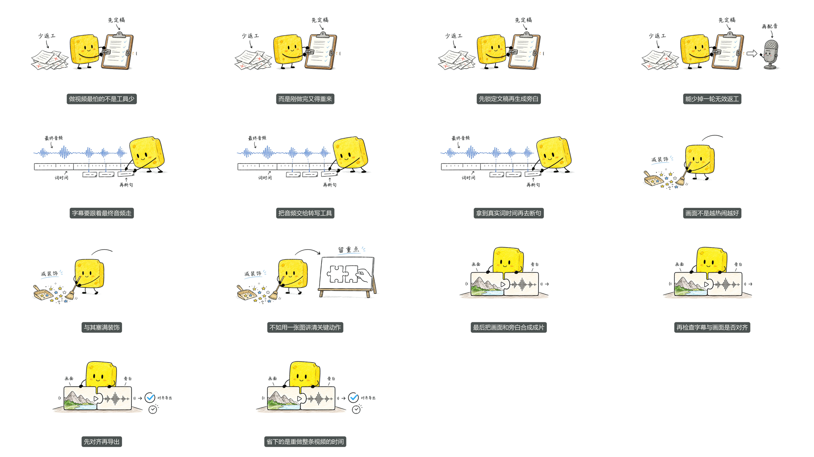

# 海绵原版全幅样片

[观看 MP4](assets/sponge/2026-09/fullscene-sample.mp4) · [媒体检查](assets/sponge/2026-09/sample-qc.json) · [公开资产哈希清单](assets/sponge/2026-09/manifest.json)

只替换小黑角色，其他设置沿用原版。四场分别说明：定稿再配音、最终音频词时间断句、减少装饰留下重点、画面与旁白对齐导出。角色直接参与场景，原生手写字保留，不以系统标签替代。

## 本次公开内容

- `fullscene-sample.mp4`：当前推荐审阅样片，32.298005 秒，1920×1080、30fps、H.264/AAC。
- `scene-01.png` 至 `scene-04.png`：该片四张原图，实际均 1672×941。
- `character-approved.png`：已批准角色设定图，仅作身份参考。
- `earlier-props.png`：前一版样片使用的原生文字道具图，作为历史素材展示；不是当前完整场景的替代方案。
- `poster.png` 与 `contact-sheet.png`：成片关键帧及联系表。
- `tutorial-cover.png`：5:2 横向教程封面，生成器实际输出 1983×793（约 5:2），保持原始像素。
- `sample-qc.json`：专项媒体检查回执。

视频 SHA-256：`5388f3038d6d96a16180aee2c85c0bbbaae4f00774fed5f8a84c3c76635d0d4a`。

## 已验证与未宣称的能力

完整视频已解码检查，媒体规格和字幕检查通过。图像以 1440×810 显示，最大采样倍率约 0.8613，没有放大。成片采用近白背景校正消除矩形纸张边界，原始 PNG 保持不变。原生中文在场景内；字幕独立使用最终音频时间。

本片是风格、清晰度及组件显现审阅样片，不代表已完成任意文稿全身角色动画，也不把样片专项 QC 宣称为正式生产全部 delivery gates。正式项目仍按原交付流程验收与归档。

公开图片是本次用户指定发布的演示素材，不包含私人参考录音、来源逐字稿、私有配置或 Provider 响应。
